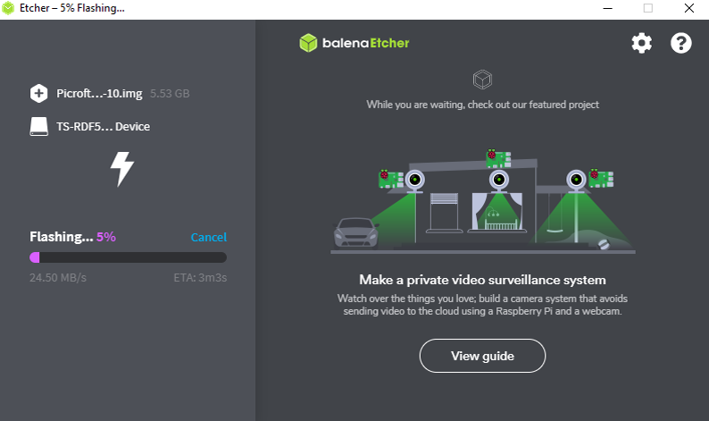
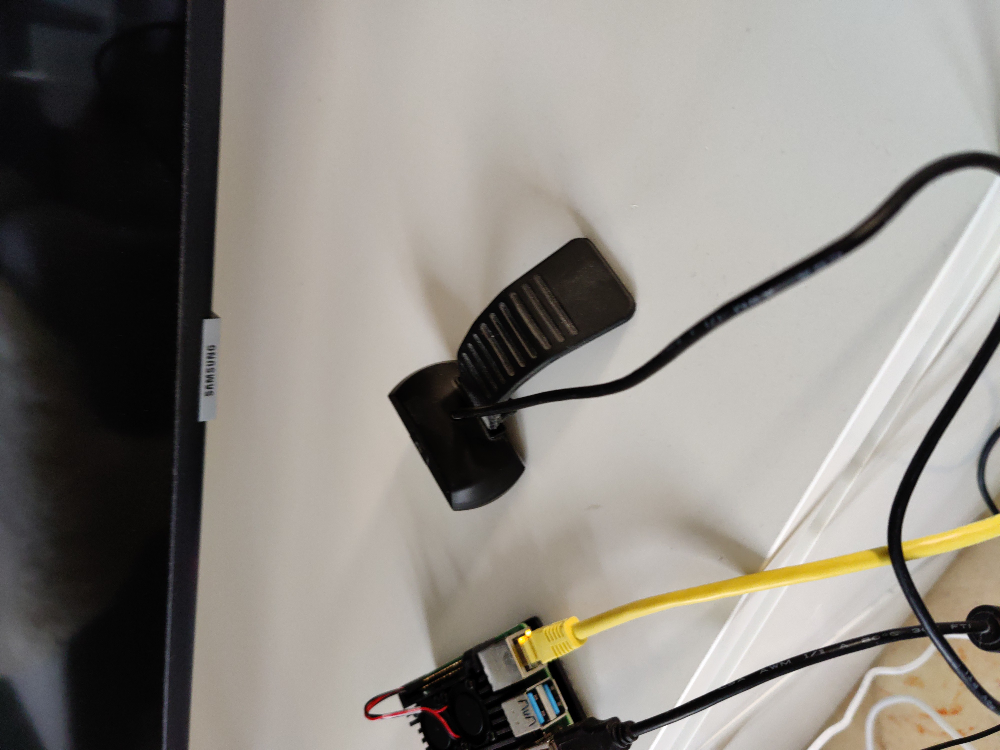
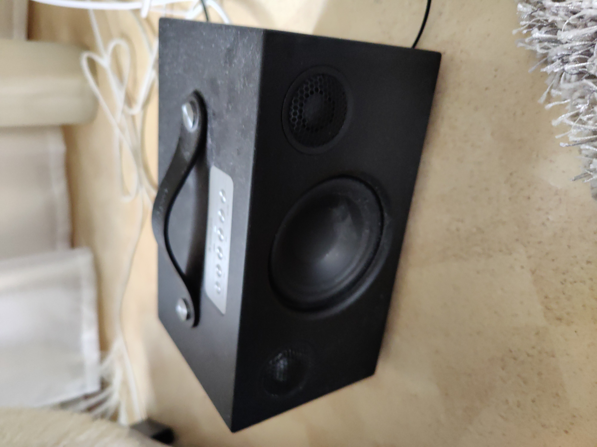
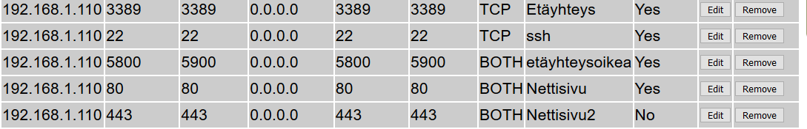
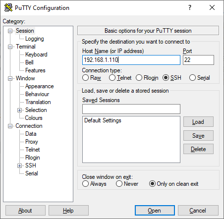
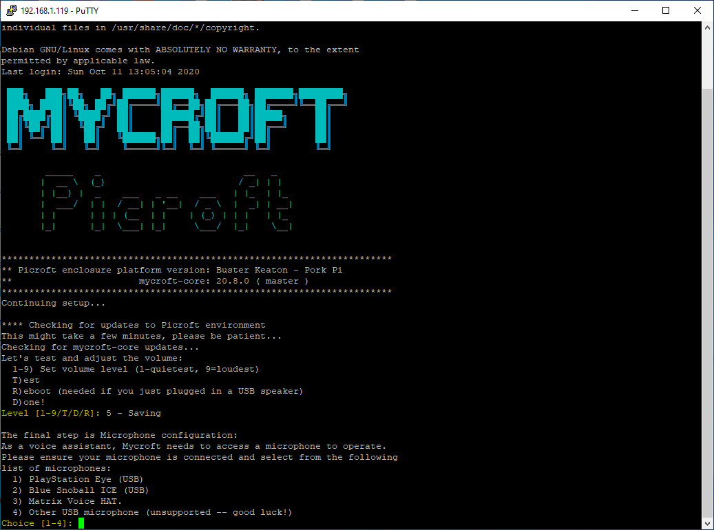
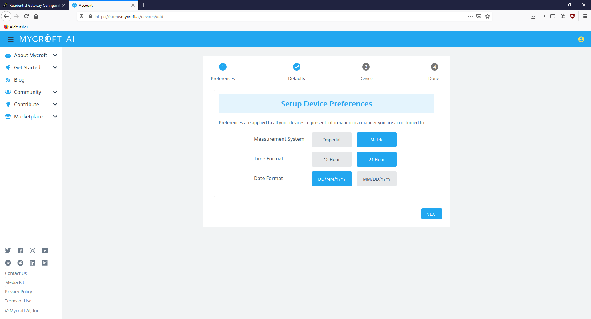
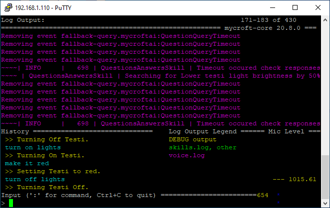
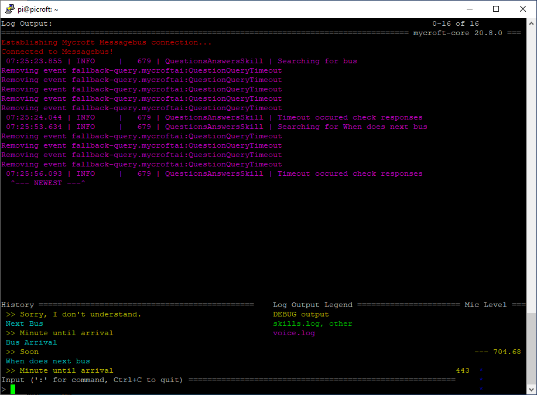

# Picroft älykaiutin

Projekti on tehty Haaga-Helian monialaprojekti kurssia varten. Tavoitteena on nopeuttaa tiedon hankkimista ja tehdä siitä vaivattomampaa. Projektin tuloksena syntyy toimiva älykaiutin hyödyntäen Raspberry Pi 4:sta ja Mycroft ääniavustajaa.

## 1. Picroftin lataaminen ja asentaminen muistikortille

Ensin ladattiin [Picroft disk image](https://drive.google.com/uc?id=1nyd5l5vgRy--Y3VG3AXUAiBio2QEF1O8&export=download).

Raspberry Pin muistikortti laitettiin USB-adapteriin, jonka avulla muistikortti saatiin liitettyä tietokoneeseen. Sen jälkeen asennettiin [balenaEtcher](https://www.balena.io/etcher/), jonka avulla saatiin Picroft asennettua muistikortille.



Laitteeseen liitettiin 3.5mm kaapelilla toimiva kaiutin ja Sandstrøm Full HD web-kamera.



Tämän jälkeen Raspberry Pi liitettiin kiinni ethernet yhteydellä ja kytkettiin päälle. 

## 2. Etähallinnan käyttöönotto

### 2.1 Porttien avaus

Määritetetään paikallinen IP-osoite, ulospäin menevä portti, sisäinen portti ja protokolla reitittimen asetuksista.


Avattu portti ja IP-osoite SSH-yhteydelle (22). Lisäksi etätyöpöytä yhteydelle (3389) ja VNC viewerille (5800-5900), jos joskus tulevaisuudessa näille tulee tarvetta. 



### 2.2 SSH-yhteyden ottaminen

Picroftissa on oletuksena SSH käyttöönotettuna, joten sitä ei tarvitse erikseen laitteesta ottaa käyttöönotettuna. Voidaan ottaa suoraan yhteys Picroftiin käyttäen PuTTYa ja Raspberry Pin sisäistä IP-osoitetta.



Kirjauduttiin sisään `käyttäjänimi: pi` ja `salasana: mycroft`, jonka jälkeen avautuu seuraavaanlainen näkymä. 



## 3. Mycroftin asentaminen

### 3.1 Mycroftin alkuasetukset

Valittiin `Y` eli guided setup.

Output äänentaso 1-9. Valittiin taso 5 painamalla `5`. Tämän jälkeen testattiin kaiuttimen toiminta painamalla `T`.

Input valitttin `4` eli joku muu USB-mikrofoni, koska Sandstrøm Full HD web-kamera ei ollut valmiina olevissa vaihtoehdoissa. Tämän jälkeen Mycroft pyytää testaamaan mikrofonia painamalla mitä tahansa näppäintä ja sanomalla mikrofoniin asioita. Kymmenen sekunnin jälkeen Mycroft toisti kyseisen ääninäytteen kaiuttimesta. Tämän jälkeen Mycroft kysyy kuuluiko kyseinen testi. Vastasimme `1` eli kyllä. 

Tämän jälkeen valitsimme käytettävän version valitsimme `1` eli Recommended - käytetään stabiilista versiota.

### 3.2 Laitteen rekisteröinti

Laite pitää rekisteröideä osoitteessa: [home.mycroft.ai](https://sso.mycroft.ai/login?redirect=https:%2F%2Fhome.mycroft.ai%2F).

Kirjauduttiin sisään omalla käyttäjällä ja tämän jälkeen syötettiin tarpeelliset tiedot, kuten mm. sijainti, käytettävät yksiköt ja ääni.

Mycroft antoi myös yksilöllisen laitekoodin, mikä piti syöttää sille annettuun kenttään rekisteröinnissä.



### 3.3 Wi-fi yhteyden muodostaminen

Muokataan tiedostoa 'wpa_supplicant.conf' komennolla `sudo nano /etc/wpa_supplicant/wpa_supplicant.conf`.

Tiedostoon laitetaan reitittimen tiedot.
```
country=FI
    network={
            ssid="MyNetworkSSID"
            psk="mypassword"
    }
```
Syötetään `Ctrl + X` to exit and `Y` then `Enter` to save your changes.
Lopuksi kirjoitetaan  `sudo reboot now`.

### 3.4 Testaaminen

Picroftissa on valmiina tiettyjä taitoja vaklmiiksi asennettuina. Ne löytyvät osoitteesta: https://mycroft-ai.gitbook.io/docs/using-mycroft-ai/basic-commands

`Hey Mycorft, news`

Picroft alkoi toistaa Ylen tämän päivän uutislähetystä. 

`Hey Mycroft, what is the weather?`

Picroft kertoi tämän päivän sään. 

Mikrofonin sijainti vaikutti tosi paljon tunnistiko Mycroft puhetta tai herätys sanaa (wakeword).

## 4. LIFX taidon asentaminen

Projektia varten on hankittu LIFX Mini Colour -älylamppu. 


Lampun hallintaan käytetään [Sawyer McLanen luomaa LIFX taitoa](https://market.mycroft.ai/skills/ff3292f1-132e-46fa-9818-fe13a45d6f92). 

Asennetaan sovellus komennolla `msm install lifx-mycorft`.

Anentamisen jälkeen uudelleen käynnistetään komennolla `sudo reboot`.

[Demo lampun toiminnasta asennetulla taidolla.](https://drive.google.com/file/d/1OOqKWghQ8k2rlqJo03hPLnIm5dxCgOaK/view?usp=sharing)



## 5. Oman taidon luonti

Loimme mycroftin skill kitin avulla.

`msk create`

Annetaan lyhyt uniikki taidon nimi.

`HSL-Tracking`

Annetaan esimerkki ilmaisuja aktivointia varten.

esim. `When does next bus arrive?`

Annetaan mycroft vastaus.

esim. `Never`

Annetaan taidon kuvaus ja pidempi kuvaus.

Annetaan laatijan GitHub nimi.

Annetaan logo osoitteesta: https://fontawesome.com/cheatsheet

Annetaan väri käyttämällä Hex-värikoodeja.

Valitaan gategoriat ja tagit Mycroft marketplacea varten.

Valitaan lisenssi:
- Apache v2.0
- GPL v3.0
- MIT
tai skip.

Sen jälkeen Mycroft kysyy riippuuko taito toisista taidoista, python paketeista jne.

Mycroft kysyy luodaanko taidolle Github repository.

Luodaan repository antamalla token:
1. Mennään osoitteeseen https://github.com/settings/tokens/new
2. Anna nimi
3. Valitaan rajaus [x] repo
4. Paina "Generate token"
5. Kopioidaan ja syötetään token Mycroftiin.

Annetaan msk:lle lupa varastoida token.

Taidon luonti on valmis.



Taidon päivittäminen onnistui kommennolla.

`msm update hsl`

Jokaisen päivityksen jälkeen raspberry piti rebootata.

`sudo reboot`


