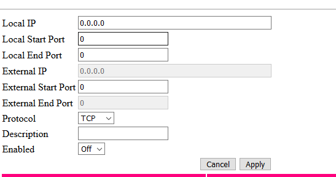

# Picroft älykaiutin

Projekti on tehty Haaga-Helian monialaprojekti kurssia varten. Tavoitteena on nopeuttaa tiedon hankkimista ja tehdä siitä vaivattomampaa. Projektin tuloksena syntyy toimiva älykaiutin hyödyntäen Raspberry Pi 4:sta ja Mycroft ääniavustajaa.

## 1. Picroftin asennus

## 2. Etähallinnan käyttöönotto

### 2.1 Porttien avaus

Määritetetään paikallinen IP-osoite, ulospäin menevä portti, sisäinen portti ja protokolla.

Avattu portti ja IP-osoite SSH-yhteydelle (22),etätyöpöytä yhteydelle (3389) ja VNC viewerille (5800-5900). 

### 2.2 SSH-yhteyden ottaminen
