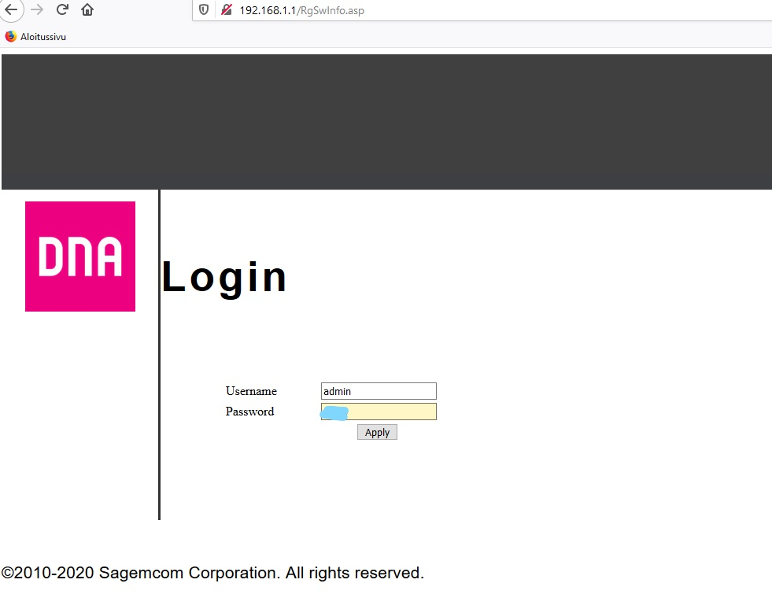

# Picroft älykaiutin

Projekti on tehty Haaga-Helian monialaprojekti kurssia varten. Tavoitteena on nopeuttaa tiedon hankkimista ja tehdä siitä vaivattomampaa. Projektin tuloksena syntyy toimiva älykaiutin hyödyntäen Raspberry Pi 4:sta ja Mycroft ääniavustajaa.

## 1. Picroftin asennus

## 2. Etähallinnan käyttöönotto

