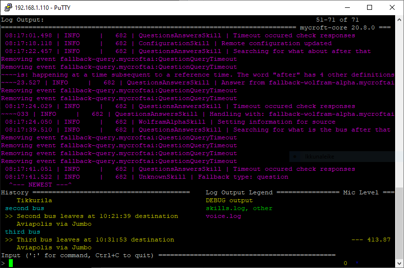

Tekijät Ergo Lorvi ja Sampo Salmela

# Picroft älykaiutin projektin yleiskuvaus

Projekti on tehty Haaga-Helian monialaprojekti kurssia varten. Tavoitteena on nopeuttaa tiedon hankkimista ja tehdä siitä vaivattomampaa. Projektin tuloksena syntyy toimiva älykaiutin hyödyntäen Raspberry Pi 4:sta ja Mycroft ääniavustajaa.

# Picroft älykaiutin projektin tekninen kuvaus

## 1. Picroftin lataaminen ja asentaminen muistikortille

Ensin ladattiin [Picroft disk image](https://drive.google.com/uc?id=1nyd5l5vgRy--Y3VG3AXUAiBio2QEF1O8&export=download).

Raspberry Pin muistikortti laitettiin USB-adapteriin, jonka avulla muistikortti saatiin liitettyä tietokoneeseen. Sen jälkeen asennettiin [balenaEtcher](https://www.balena.io/etcher/), jonka avulla saatiin Picroft asennettua muistikortille.


Laitteeseen liitettiin 3.5mm kaapelilla toimiva kaiutin ja Sandstrøm Full HD web-kamera.


Tämän jälkeen Raspberry Pi liitettiin kiinni ethernet yhteydellä ja kytkettiin päälle. 

## 2. Etähallinnan käyttöönotto

### 2.1 Porttien avaus

Määritetetään paikallinen IP-osoite, ulospäin menevä portti, sisäinen portti ja protokolla reitittimen asetuksista.


Avattu portti ja IP-osoite SSH-yhteydelle (22). Lisäksi etätyöpöytä yhteydelle (3389) ja VNC viewerille (5800-5900), jos joskus tulevaisuudessa näille tulee tarvetta. 


### 2.2 SSH-yhteyden ottaminen

Picroftissa on oletuksena SSH käyttöönotettuna, joten sitä ei tarvitse erikseen laitteesta ottaa käyttöönotettuna. Voidaan ottaa suoraan yhteys Picroftiin käyttäen PuTTYa ja Raspberry Pin sisäistä IP-osoitetta.


Kirjauduttiin sisään `käyttäjänimi: pi` ja `salasana: mycroft`, jonka jälkeen avautuu seuraavaanlainen näkymä. 


## 3. Mycroftin asentaminen

### 3.1 Mycroftin alkuasetukset

Valittiin `Y` eli guided setup.

Output äänentaso 1-9. Valittiin taso 5 painamalla `5`. Tämän jälkeen testattiin kaiuttimen toiminta painamalla `T`.

Input valitttin `4` eli joku muu USB-mikrofoni, koska Sandstrøm Full HD web-kamera ei ollut valmiina olevissa vaihtoehdoissa. Tämän jälkeen Mycroft pyytää testaamaan mikrofonia painamalla mitä tahansa näppäintä ja sanomalla mikrofoniin asioita. Kymmenen sekunnin jälkeen Mycroft toisti kyseisen ääninäytteen kaiuttimesta. Tämän jälkeen Mycroft kysyy kuuluiko kyseinen testi. Vastasimme `1` eli kyllä. 

Tämän jälkeen valitsimme käytettävän version valitsimme `1` eli Recommended - käytetään stabiilista versiota.

### 3.2 Laitteen rekisteröinti

Laite pitää rekisteröideä osoitteessa: [home.mycroft.ai](https://sso.mycroft.ai/login?redirect=https:%2F%2Fhome.mycroft.ai%2F).

Kirjauduttiin sisään omalla käyttäjällä ja tämän jälkeen syötettiin tarpeelliset tiedot, kuten mm. sijainti, käytettävät yksiköt ja ääni.

Mycroft antoi myös yksilöllisen laitekoodin, mikä piti syöttää sille annettuun kenttään rekisteröinnissä.


### 3.3 Wi-fi yhteyden muodostaminen

Muokataan tiedostoa 'wpa_supplicant.conf' komennolla `sudo nano /etc/wpa_supplicant/wpa_supplicant.conf`.

Tiedostoon laitetaan reitittimen tiedot.
```
country=FI
    network={
            ssid="MyNetworkSSID"
            psk="mypassword"
    }
```
Syötetään `Ctrl + X` to exit and `Y` then `Enter` to save your changes.
Lopuksi kirjoitetaan  `sudo reboot now`.

### 3.4 Testaaminen

Picroftissa on valmiina tiettyjä taitoja vaklmiiksi asennettuina. Ne löytyvät osoitteesta: https://mycroft-ai.gitbook.io/docs/using-mycroft-ai/basic-commands

`Hey Mycorft, news`

Picroft alkoi toistaa Ylen tämän päivän uutislähetystä. 

`Hey Mycroft, what is the weather?`

Picroft kertoi tämän päivän sään. 

Mikrofonin sijainti vaikutti tosi paljon tunnistiko Mycroft puhetta tai herätys sanaa (wakeword).

## 4. LIFX taidon asentaminen

Projektia varten on hankittu LIFX Mini Colour -älylamppu. 


Lampun hallintaan käytetään [Sawyer McLanen luomaa LIFX taitoa](https://market.mycroft.ai/skills/ff3292f1-132e-46fa-9818-fe13a45d6f92). 

Asennetaan sovellus komennolla `msm install lifx-mycorft`.

Anentamisen jälkeen uudelleen käynnistetään komennolla `sudo reboot`.

[Demo lampun toiminnasta asennetulla taidolla.](https://drive.google.com/file/d/1OOqKWghQ8k2rlqJo03hPLnIm5dxCgOaK/view?usp=sharing)


## 5. Oman taidon luonti (HSL Tracking Skill)

### 5.1 Pohjan luonti

HSL tracking skill repo:
https://github.com/samposalmela/hsl-tracking-skill

Loimme mycroftin skill kitin avulla template taidon (pohja).

`msk create`

Annetaan lyhyt uniikki taidon nimi.

`HSL-Tracking`

Annetaan esimerkki ilmaisuja aktivointia varten.

esim. `When does next bus arrive?`

Annetaan mycroft vastaus.

esim. `Never`

Annetaan taidon kuvaus ja pidempi kuvaus.

Annetaan laatijan GitHub nimi.

Annetaan logo osoitteesta: https://fontawesome.com/cheatsheet

Annetaan väri käyttämällä Hex-värikoodeja.

Valitaan gategoriat ja tagit Mycroft marketplacea varten.

Valitaan lisenssi:
- Apache v2.0
- GPL v3.0
- MIT
tai skip.

Sen jälkeen Mycroft kysyy riippuuko taito toisista taidoista, python paketeista jne.

Mycroft kysyy luodaanko taidolle Github repository.

Luodaan repository antamalla token:
1. Mennään osoitteeseen https://github.com/settings/tokens/new
2. Anna nimi
3. Valitaan rajaus [x] repo
4. Paina "Generate token"
5. Kopioidaan ja syötetään token Mycroftiin.

Annetaan msk:lle lupa varastoida token.

Taidon luonti on valmis.


### 5.2 Python koodin kirjoittaminen

Aloitimme taidon luomisen tekemällä pelkän Pythonissa toimivan toteutuksen ilman Mycroft ominaisuuksia.

Haetaan ensin tarvittavat moduulit API:n käsittelyä ja ajan käsittelyä varten.
```
import requests
import datetime
```

Sen jälkeen noudetaan API.
```
def run_query(query): # A simple function to use requests.post to make the API call. Note the json= section.
    request = requests.post('https://api.digitransit.fi/routing/v1/routers/hsl/index/graphql', json={'query': query})
    if request.status_code == 200:
        return request.json()
    else:
        raise Exception("Query failed to run by returning code of {}. {}".format(request.status_code, query))
```

Käytetään GraphQL:lää tiedon kuvaamiseen ja kysymiseen.
```
query = """
{
  stop(id: "HSL:4610237") {
    name
      stoptimesWithoutPatterns {
      scheduledArrival
      realtimeArrival
      arrivalDelay
      scheduledDeparture
      realtimeDeparture
      departureDelay
      realtime
      realtimeState
      serviceDay
      headsign
    }
  }  
}
"""
```

Suoritetaan kysely ja haetaan tarvittava tieto.
```
#Suoritetaan kysely
result = run_query(query) 

#Haetaan tarvittavat tiedot kaivamalla
json_output = result 
output = json_output['data']
stop = output['stop']
times = stop['stoptimesWithoutPatterns']

#3 seuraavaa bussia
next = times[0]
second = times[1]
third = times [2]
```

Muutetaan ajat vastaamaan kellon aikaa ja haettiin myös bussien suuntaotsakkeet.
```
conversion = datetime.timedelta(seconds=next['realtimeArrival'])
arrival_time = str(conversion)

conversion = datetime.timedelta(seconds=second['realtimeArrival'])
arrival_time2 = str(conversion)

conversion = datetime.timedelta(seconds=third['realtimeArrival'])
arrival_time3 = str(conversion)

headsign = next['headsign']
```

Lopuksi saatiin loppu tulokseksi kolmen seurvaan bussin reaaliaikaiset saapumisajankohdat, sekä suuntaotsakkeet.
```
print(arrival_time,next['headsign'])
print(arrival_time2,after['headsign'])
print(arrival_time3,last['headsign'])

```
Output:
```
16:32:08 Tikkurila
16:38:33 Aviapolis via Jumbo
16:45:53 Aviapolis via Jumbo
```

### 5.3 Mycroft ominaisuuksien lisääminen Python koodiin

Hetaan Mycroftin käyttämät moduulit.
```
from adapt.intent import IntentBuilder
from mycroft import MycroftSkill, intent_handler
```

Samalla tavalla noudetaan API ja kysytään sen sisältöä GraphQL:n avulla. Luodaan luokka `HslSkill(MycroftSkill)`, jonka sisään tulee kaikki taidon tarvitsemat ominaisuudet.
```
class HslSkill(MycroftSkill):
    def __init__(self):
        super(HslSkill, self).__init__(name='HslSkill')

    def initialize(self):
        self.load_data_files(dirname(__file__))

    @intent_handler(IntentBuilder('NextBusIntent').require('NextBusKeyword'))
    def next_bus_intent(self, message):
        result = run_query(query)
        json_output = result
        output = json_output['data']

        stop = output['stop']
        times = stop['stoptimesWithoutPatterns']

        next = times[0]
      
        conversion = datetime.timedelta(seconds=next['realtimeArrival'])
        arrival_time = str(conversion)
        headsign = next['headsign']

        self.speak_dialog("Next bus leaves at {} destination {}".format(arrival_time, headsign))
```

Tehdään tarvittavat "Keyword" tiedostot, jotka sisältävät Mycroftin tarvitsemat avainsanat taidon aktivointia varten.

NextBysKeyword.voc:
```
next bus
what is the next bus
when does the next bus arrive
```

Luodaan "intent.json" tiedostot, jotta oikea avainsana yhdistyy oikean tarkoituksen kanssa.
```
{
  "utterance": "Next bus",
  "intent_type": "NexBusIntent",
  "intent": {
    "NextBusKeyword": "next bus"
  }
}
```
Taito koodipätkän jälkeen



### 5.4 Taidon päivittäminen

Taidon päivittäminen onnistui kommennolla.

`msm update hsl`


Jokaisen päivityksen jälkeen raspberry piti rebootata.

`sudo reboot`

### 5.5 Ongelmat taidon luonnissa

Välillä tuli myös virheitä.

Tämä virhe tapahtui, kun kokeilimme tehdä taitoon jatkokysymyksiä. Esim. Kun kysytään seuraavaa bussia ja kysyisi heti perään seuraavaa.


Seuraava virhekoodi tapahtui, kun kokeilimme hieman siivota koodipätkää, siirtämällä kyselyn suorittamisen ja sen kaivamisen "intent handlerien" yläpuolelle, jotta tämä olisi tarvinnut suorittaa vain kerran.


# Projektin lopputulos

Projektin lopputuloksena meillä on toimiva Picroft älykaiutin, jolta pystyy kysymään seuraavien bussien saapumisajankohdat. Projekti oli onnistunut siinä mielessä, että saimme projektin minimitavoitteen täytettyä aikataulun sisällä.

### Projektin lopputilanteen puutteet

Picroft laitteistosta oli tarkoitus luoda myös ulkonäköisesti mielyttävä, mutta laitoimme laitteen toimivuuden ulkonäön edelle.

### Projektin jatkokehitystarpeet

Halusimme saada taidon ja mycroftin toimimaan suomen kielellä, mikä oli mahdollista, mutta halusimme käyttää resurssit laitteen toimivuuteen.

Halusimme myös mahdollisuuden kysyä jatkokysymyksen luomaltamme taidolta, mutta se seurasi ainoastaan virhekoodeihin lukuisten yrityksien jälkeen, joten jouduimme unohtamaan kyseisen toiminnon. Myös muun tiedon hakeminen Digitransit API:sta, kuten esim. voiko bussiin päästä pyörätyolilla, oli myös tarkoitus sisällyttää jatkokysymyksiin. 

### Lähteet

https://mycroft-ai.gitbook.io/docs/

https://digitransit.fi/en/developers/apis/1-routing-api/stops/

https://graphql.org/code/#python
